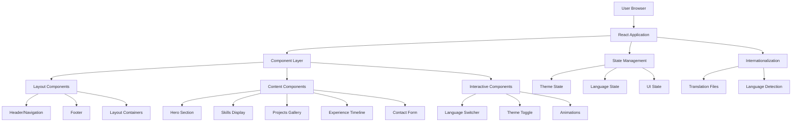

# Design Document: Website Redesign

## Overview

This design document outlines the complete redesign of Silas Mahler's portfolio website. The redesign will transform the existing React-based website into a modern, performant, and engaging portfolio that showcases Silas's expertise as a Senior Delivery Architect specializing in Cloud & DevOps.

The design emphasizes modern visual aesthetics, enhanced user experience, optimal performance, and maintainable architecture while preserving all existing functionality and content.

## Architecture

### High-Level Architecture



### Technology Stack

- **Frontend Framework**: React 18+ with TypeScript
- **Build Tool**: Vite for fast development and optimized builds
- **Styling**: Tailwind CSS with custom design system
- **Animations**: Framer Motion for smooth animations and transitions
- **Internationalization**: React-i18next for German/English support
- **State Management**: React Context API and custom hooks
- **Performance**: React.lazy for code splitting, React.memo for optimization
- **Accessibility**: Focus management and ARIA implementation

## Components and Interfaces

### Core Layout Components

#### AppLayout Component
```typescript
interface AppLayoutProps {
  children: React.ReactNode;
  className?: string;
}

interface LayoutContextType {
  isMobile: boolean;
  isTablet: boolean;
  isDesktop: boolean;
  scrollY: number;
  isScrolled: boolean;
}
```

#### Navigation Component
```typescript
interface NavigationProps {
  isFixed?: boolean;
  showBackground?: boolean;
}

interface NavigationItem {
  id: string;
  labelKey: string;
  href: string;
  icon?: React.ComponentType;
}
```

### Content Display Components

#### Hero Section
```typescript
interface HeroSectionProps {
  name: string;
  title: string;
  subtitle: string;
  description: string;
  profileImage: string;
  socialLinks: SocialLink[];
}

interface SocialLink {
  platform: string;
  url: string;
  icon: React.ComponentType;
}
```

#### Skills Component
```typescript
interface SkillsProps {
  skillCategories: SkillCategory[];
  displayMode: 'grid' | 'list' | 'interactive';
}

interface SkillCategory {
  id: string;
  nameKey: string;
  skills: Skill[];
}

interface Skill {
  name: string;
  level: number; // 1-5 or 1-100
  icon?: string;
  description?: string;
}
```

#### Projects Gallery
```typescript
interface ProjectsGalleryProps {
  projects: Project[];
  layout: 'grid' | 'masonry' | 'carousel';
  filterEnabled?: boolean;
}

interface Project {
  id: string;
  title: string;
  description: string;
  technologies: string[];
  images: string[];
  liveUrl?: string;
  githubUrl?: string;
  featured: boolean;
  category: string;
}
```

#### Experience Timeline
```typescript
interface ExperienceTimelineProps {
  experiences: Experience[];
  layout: 'vertical' | 'horizontal';
}

interface Experience {
  id: string;
  company: string;
  position: string;
  startDate: Date;
  endDate?: Date;
  description: string;
  achievements: string[];
  technologies: string[];
  location: string;
}
```

### Interactive Components

#### Language Switcher
```typescript
interface LanguageSwitcherProps {
  currentLanguage: string;
  availableLanguages: Language[];
  onLanguageChange: (language: string) => void;
}

interface Language {
  code: string;
  name: string;
  flag: string;
}
```

#### Theme Provider
```typescript
interface ThemeContextType {
  theme: 'light' | 'dark' | 'auto';
  setTheme: (theme: 'light' | 'dark' | 'auto') => void;
  isDark: boolean;
}
```

#### Animation Components
```typescript
interface AnimatedSectionProps {
  children: React.ReactNode;
  animation: 'fadeIn' | 'slideUp' | 'slideLeft' | 'scale';
  delay?: number;
  duration?: number;
  threshold?: number;
}
```

## Data Models

### Portfolio Data Structure
```typescript
interface PortfolioData {
  personal: PersonalInfo;
  skills: SkillCategory[];
  experience: Experience[];
  education: Education[];
  projects: Project[];
  certifications: Certification[];
  contact: ContactInfo;
}

interface PersonalInfo {
  name: string;
  title: string;
  subtitle: string;
  bio: string;
  profileImage: string;
  location: string;
  availability: string;
}

interface Education {
  id: string;
  institution: string;
  degree: string;
  field: string;
  startDate: Date;
  endDate?: Date;
  gpa?: number;
  achievements?: string[];
}

interface Certification {
  id: string;
  name: string;
  issuer: string;
  issueDate: Date;
  expiryDate?: Date;
  credentialId?: string;
  verificationUrl?: string;
  badge?: string;
}

interface ContactInfo {
  email: string;
  phone?: string;
  location: string;
  socialLinks: SocialLink[];
  availability: string;
}
```

### Design System Configuration
```typescript
interface DesignSystem {
  colors: ColorPalette;
  typography: TypographyScale;
  spacing: SpacingScale;
  breakpoints: Breakpoints;
  animations: AnimationConfig;
}

interface ColorPalette {
  primary: ColorShades;
  secondary: ColorShades;
  accent: ColorShades;
  neutral: ColorShades;
  semantic: SemanticColors;
}

interface ColorShades {
  50: string;
  100: string;
  200: string;
  300: string;
  400: string;
  500: string;
  600: string;
  700: string;
  800: string;
  900: string;
}

interface TypographyScale {
  fontFamilies: {
    heading: string;
    body: string;
    mono: string;
  };
  fontSizes: Record<string, string>;
  fontWeights: Record<string, number>;
  lineHeights: Record<string, number>;
}
```

## Design System Specifications

### Color Palette
- **Primary**: Modern blue gradient (#3B82F6 to #1E40AF)
- **Secondary**: Complementary purple (#8B5CF6 to #5B21B6)
- **Accent**: Vibrant cyan (#06B6D4) for highlights
- **Neutral**: Sophisticated grays (#F8FAFC to #0F172A)
- **Semantic**: Success (#10B981), Warning (#F59E0B), Error (#EF4444)

### Typography
- **Heading Font**: Inter or similar modern sans-serif
- **Body Font**: Inter for consistency and readability
- **Mono Font**: JetBrains Mono for code snippets
- **Scale**: Fluid typography using clamp() for responsive sizing

### Spacing and Layout
- **Grid System**: CSS Grid and Flexbox for modern layouts
- **Container**: Max-width with responsive padding
- **Spacing Scale**: 4px base unit (0.25rem) with consistent multipliers
- **Breakpoints**: Mobile (320px+), Tablet (768px+), Desktop (1024px+), Large (1280px+)

### Animation Principles
- **Duration**: 150ms for micro-interactions, 300ms for transitions, 500ms for page changes
- **Easing**: Custom cubic-bezier curves for natural motion
- **Reduced Motion**: Respect user preferences for accessibility
- **Performance**: GPU-accelerated transforms and opacity changes

## Modern Design Features

### Visual Enhancements
1. **Gradient Backgrounds**: Subtle gradients for depth and modern appeal
2. **Glassmorphism**: Semi-transparent elements with backdrop blur
3. **Neumorphism**: Soft shadows and highlights for tactile feel
4. **Custom Illustrations**: SVG icons and illustrations for personality
5. **Interactive Hover States**: Smooth transitions and micro-animations

### Layout Innovations
1. **Asymmetrical Grids**: Breaking traditional grid patterns for visual interest
2. **Overlapping Elements**: Layered content for depth perception
3. **Whitespace Usage**: Generous spacing for clean, breathable design
4. **Sticky Navigation**: Context-aware navigation that adapts to scroll position
5. **Progressive Disclosure**: Revealing content as users scroll or interact

### Interactive Elements
1. **Parallax Scrolling**: Subtle depth effects on background elements
2. **Scroll-triggered Animations**: Content reveals based on viewport position
3. **Interactive Skill Bars**: Animated progress indicators
4. **Project Hover Effects**: Dynamic previews and information overlays
5. **Smooth Page Transitions**: Seamless navigation between sections

## Correctness Properties

*A property is a characteristic or behavior that should hold true across all valid executions of a system—essentially, a formal statement about what the system should do. Properties serve as the bridge between human-readable specifications and machine-verifiable correctness guarantees.*

After analyzing the acceptance criteria, I've identified several properties that can be combined for more comprehensive validation:

**Property Reflection:**
- Properties 1.1 and 1.4 (design system consistency) can be combined into a single comprehensive property
- Properties 3.2, 3.3, 3.4, and 3.5 (responsive behavior) can be consolidated into one responsive design property
- Properties 6.2 and 6.4 (internationalization) can be combined into a comprehensive translation property
- Properties 10.1, 10.2, and 10.3 (code architecture) can be merged into a single code quality property

### Property 1: Design System Consistency
*For any* component in the Portfolio_Website, all styling values should come from the design system configuration and no hardcoded CSS values should exist outside the defined design tokens.
**Validates: Requirements 1.1, 1.4**

### Property 2: Modern CSS Implementation
*For any* styled element in the Portfolio_Website, modern CSS techniques including gradients, shadows, and transitions should be properly applied where specified in the design system.
**Validates: Requirements 1.3**

### Property 3: Interactive Element Feedback
*For any* interactive element in the Portfolio_Website, hover states, focus states, and appropriate event handlers should be implemented with proper CSS transitions.
**Validates: Requirements 2.2, 2.3**

### Property 4: Progressive Content Disclosure
*For any* content section that uses progressive disclosure, content should be initially hidden and revealed through user interaction or scroll position triggers.
**Validates: Requirements 2.5**

### Property 5: Responsive Design Compliance
*For any* screen width between 320px and 2560px, all content should remain accessible, readable, and properly formatted according to the defined breakpoint specifications.
**Validates: Requirements 3.1, 3.2, 3.3, 3.4, 3.5**

### Property 6: Performance Optimization Implementation
*For any* image or non-critical content, lazy loading attributes and modern image formats should be implemented with appropriate fallbacks.
**Validates: Requirements 4.2, 4.3**

### Property 7: Bundle Optimization
*For any* production build, code splitting should be implemented and unused code should be eliminated through tree shaking.
**Validates: Requirements 4.4**

### Property 8: Layout Stability
*For any* content element, defined dimensions should prevent layout shifts during loading and rendering.
**Validates: Requirements 4.5**

### Property 9: Content Component Completeness
*For any* content component (skills, projects, experience, certifications, contact), all required information fields and visual indicators should be present and properly formatted.
**Validates: Requirements 5.1, 5.2, 5.3, 5.4, 5.5**

### Property 10: Language Switcher Accessibility
*For any* page in the Portfolio_Website, the language switcher should be present, visible, and accessible to users.
**Validates: Requirements 6.1**

### Property 11: Internationalization Completeness
*For any* text content in the Portfolio_Website, translation keys should be used instead of hardcoded strings, and language changes should update content without page reloads.
**Validates: Requirements 6.2, 6.4**

### Property 12: Language Preference Persistence
*For any* language selection, the preference should be stored in localStorage and persist across browser sessions.
**Validates: Requirements 6.3**

### Property 13: Cross-Language Layout Consistency
*For any* language switch, the layout should remain visually consistent despite different text lengths.
**Validates: Requirements 6.5**

### Property 14: Scroll-Triggered Animations
*For any* content section with scroll animations, appropriate animation classes and intersection observers should be implemented.
**Validates: Requirements 7.2**

### Property 15: Interactive Animation Elements
*For any* interactive component, animation properties and event handlers should be properly implemented.
**Validates: Requirements 7.3**

### Property 16: Natural Animation Easing
*For any* CSS transition, appropriate easing functions should be used instead of linear transitions.
**Validates: Requirements 7.4**

### Property 17: Reduced Motion Accessibility
*For any* animation, prefers-reduced-motion media queries should be implemented and respected.
**Validates: Requirements 7.5**

### Property 18: Semantic HTML and ARIA Implementation
*For any* interactive or content element, proper ARIA attributes and semantic HTML elements should be used.
**Validates: Requirements 8.2**

### Property 19: SEO Meta Implementation
*For any* page, required meta tags and structured data should be present and properly formatted.
**Validates: Requirements 8.3**

### Property 20: Keyboard Navigation Support
*For any* focusable element, visible focus styles should be implemented and tab order should be logical.
**Validates: Requirements 8.4**

### Property 21: Color Contrast Compliance
*For any* text and interactive element combination, color contrast ratios should meet WCAG requirements.
**Validates: Requirements 8.5**

### Property 22: Content-Presentation Separation
*For any* component, content should be received as props and no hardcoded content should exist within component logic.
**Validates: Requirements 9.1, 9.3**

### Property 23: Data Structure Consistency
*For any* data object (projects, experiences, skills), the structure should follow defined TypeScript interfaces and validation schemas.
**Validates: Requirements 9.5**

### Property 24: Component Architecture Quality
*For any* React component, proper TypeScript interfaces should be defined, React best practices should be followed, and no 'any' types should be used.
**Validates: Requirements 10.1, 10.2, 10.3**

### Property 25: Error Handling Implementation
*For any* component that can fail, error boundaries and fallback UI should be implemented for error states.
**Validates: Requirements 10.4**

### Property 26: Production Build Optimization
*For any* production build, proper optimization settings and caching strategies should be implemented.
**Validates: Requirements 10.5**

## Error Handling

### Component-Level Error Handling
- **Error Boundaries**: Implement React error boundaries around major sections to catch and display fallback UI
- **Graceful Degradation**: Ensure core functionality remains available even if advanced features fail
- **Loading States**: Provide appropriate loading indicators for asynchronous operations
- **Fallback Content**: Display meaningful fallback content when data is unavailable

### Network and Data Handling
- **Image Loading**: Implement fallback images and error states for broken image links
- **Translation Loading**: Provide fallback text when translations are unavailable
- **Local Storage**: Handle cases where localStorage is unavailable or full
- **Browser Compatibility**: Provide polyfills and fallbacks for unsupported features

### User Experience Error Handling
- **Form Validation**: Provide clear, accessible error messages for form inputs
- **Navigation Errors**: Handle invalid routes and provide helpful navigation options
- **Performance Degradation**: Gracefully handle slow network conditions
- **Accessibility Fallbacks**: Ensure functionality remains available when assistive technologies are used

## Testing Strategy

### Dual Testing Approach

The testing strategy employs both unit testing and property-based testing to ensure comprehensive coverage:

**Unit Tests**: Focus on specific examples, edge cases, and integration points
- Component rendering with various props
- User interaction scenarios
- Error boundary behavior
- Accessibility compliance for specific elements
- Performance benchmarks for critical paths

**Property Tests**: Verify universal properties across all inputs
- Design system consistency across all components
- Responsive behavior across all screen sizes
- Internationalization completeness for all content
- Accessibility compliance for all interactive elements
- Performance optimization implementation

### Property-Based Testing Configuration

- **Testing Library**: React Testing Library with custom property test utilities
- **Iterations**: Minimum 100 iterations per property test for thorough coverage
- **Test Tagging**: Each property test references its design document property
- **Tag Format**: `Feature: website-redesign, Property {number}: {property_text}`

### Testing Tools and Setup

- **Unit Testing**: Jest + React Testing Library for component testing
- **Property Testing**: Custom generators for component props and user interactions
- **Accessibility Testing**: @testing-library/jest-dom + axe-core for a11y validation
- **Performance Testing**: Lighthouse CI for automated performance audits
- **Visual Testing**: Chromatic or similar for visual regression testing

### Test Coverage Requirements

- **Component Coverage**: 100% of components must have unit tests
- **Property Coverage**: All 26 correctness properties must have corresponding property tests
- **Accessibility Coverage**: All interactive elements must pass accessibility tests
- **Performance Coverage**: Core user journeys must meet performance benchmarks
- **Cross-browser Coverage**: Testing across modern browsers (Chrome, Firefox, Safari, Edge)